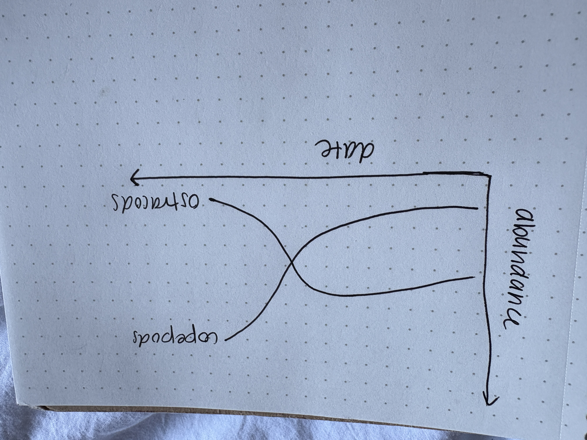

# Set up

## Packages

```{r}
#| label: packages

# general use and cleaning
library(tidyverse)
library(here)
library(janitor)
library(snakecase)

# wrapping axis labels
library(scales)

# reading in .xlsx files
library(readxl)

# visualizing missing data
library(naniar)

# arranging plots
library(patchwork)

#colors 
library(NatParksPalettes)
```

## Data

```{r}
#| label: data 

veg <- read_csv(here("data", "veg.csv"))

metadata <- read_csv(here("data", "vp_veg_metadata.csv"))

# create a new object from veg
pools_implicitNA <- veg |> 
  # filter all occurrences where transect_name contains VP
  filter(str_detect(transect_name, "VP")) |> 
  # group by year, pool, and species
  group_by(year, transect_name, psoc) |>
  # calculate mean percent cover
  summarize(mean_pc = mean(percent_cover, na.rm = TRUE)) |> 
  # ungroup data frame
  ungroup() |> 
  # create a new column called year_pool from year and transect name
  unite("year_pool", year, transect_name, remove = TRUE) |>
  # join with metadata by year_pool
  left_join(metadata, by = "year_pool")

# create a new object from veg
pools_explicit0 <- veg |> 
  # filter all occurrences where transect_name contains VP
  filter(str_detect(transect_name, "VP")) |> 
  # complete all possible combinations of year, pool, psoc and distance
  complete(year, transect_name, psoc, transect_distance,
           # fill values of percent cover with 0
           fill = list(percent_cover = 0)
           ) |>
  # group by year, pool, and psoc
  group_by(year, transect_name, psoc) |>
  # calculate total percent cover across all quads
  summarize(sum_pc = sum(percent_cover, na.rm = TRUE)) |>
  # ungroup the data frame
  ungroup() |>
  # create a new column called year_pool from year and transect name
  unite("year_pool", year, transect_name, remove = TRUE) |> 
  # join with metadata data frame
  left_join(metadata, by = "year_pool") |> 
  # calculate mean percent cover from total percent cover/number of quadrats
  mutate(mean_pc = sum_pc/num_quad)

# creating new ojbect from implicit NA data frame
filtered_implicitNA <- pools_implicitNA |> 
  # filter to only include 
  filter(psoc == "Eryngium_vaseyi")

filtered_explicit0 <- pools_explicit0 |> 
  filter(psoc == "Eryngium_vaseyi")

# taxonomic information
taxon_list <- read_csv(here("data", "taxon_list.csv")) 

# aquatic invertebrates
aq_ins <- read_xlsx(here("data", "Aquatic Sampling Data-2026-03-10.xlsx"),
                    sheet = "Aquatic Insects") 

# site information
sites <- read_xlsx(here("data", "Aquatic Sampling Data-2026-03-10.xlsx"),
                   sheet = "sites")

# water quality information
water_quality <- read_xlsx(here("data",
                                "Aquatic Sampling Data-2026-03-10.xlsx"),
                           sheet = "Water Quality",
                           na = c("", "n/a", "N/A", "over", "173+")) 

# creating new object from sites
ncos_sites <- sites |> 
  # filter to only include NCOS sites sampled four times a year
  filter(sector == "NCOS" & sampling_frequency == "Quarterly")

# creating new clean object from taxon_list
taxon_list_clean <- taxon_list |> 
  # converting taxon name to snake case (no spaces or capital letters,
  # only underscores)
  mutate(verbatim_name = to_any_case(verbatim_name, case = "snake"))

# creating new clean object from water quality
water_quality_clean <- water_quality |> 
  # clean column names
  clean_names() |> 
  # filtering join: only include sites in ncos_sites
  semi_join(ncos_sites, by = "site") |> 
  # create new column to join with later data frames
  unite("date_site", date, site, remove = TRUE) |> 
  # group by date_site column
  group_by(date_site) |> 
  # calculate median pH, salinity, DO
  summarize(med_ph = median(p_h, na.rm = TRUE),
            med_sal = median(salinity_ppt, na.rm = TRUE),
            med_do = median(dissolved_oxygen_mg_l, na.rm = TRUE)) |> 
  # ungroup data frame
  ungroup() |> 
  # filter out salinity outliers
  filter(date_site != "2022-08-12_NVBR") 

# creating new clean object from aquatic inverts
aq_ins_clean <- aq_ins |> 
  # clean column names
  clean_names() |> 
  # filtering join: only include sites occurring in ncos_sites
  semi_join(ncos_sites, by = c("site")) |> 
  # renaming columns
  rename(date = date_on_vial) |> 
  # select columns of interest
  select(date, sample_type, site,
         ostracod,
         copepod,
         hemiptera_corixidae_boatman,
         cladocera,
         nematode,
         diptera_ceratopogonidae, 
         annelida_oligochaete,
         diptera_chironomid,
         annelida_polychaete) |> 
  # filter to only include "filtered beaker" samples
  filter(sample_type %in% c("FB 250", "FB250")) |> 
  # convert the data frame to long format
  pivot_longer(cols = ostracod:annelida_polychaete,
               names_to = "taxon",
               values_to = "abundance") |> 
  # group by date, site, taxon
  group_by(date, site, taxon) |> 
  # calculate average abundance per liter 
  # (sum abundance divided by 7.5 liters)
  summarize(ave_lit = sum(abundance, na.rm = TRUE)/7.5) |> 
  # ungroup data frame
  ungroup() |> 
  # create a new column called `date_site` to join with water quality
  unite("date_site", date, site, remove = FALSE) |> 
  # join with water quality
  left_join(water_quality_clean, by = c("date_site")) |> 
  # join with taxon list
  left_join(taxon_list_clean, by = c("taxon" = "verbatim_name")) |> 
  # add full names of sites
  mutate(site_full = case_when(
    site == "NVBR" ~ "North of Venoco Bridge",
    site == "NEC" ~ "South of Venoco Bridge",
    site == "NMC" ~ "Main Channel",
    site == "NPB" ~ "South of Phelps Bridge",
    site == "NPB1" ~ "North of Phelps Bridge",
    site == "NPB2" ~ "Phelps Road",
    site == "NWP" ~  "West Pond",
    site == "NDC" ~ "Devereux Creek"
  )) |> 
  # setting factor levels for site
  mutate(site_full = fct_reorder(site_full, med_sal,
                                 .fun = "median", .na_rm = TRUE),
         site_full = fct_rev(site_full))

```

# 1. Explain your inspiration

-   For my Intermediate elective, I chose the coal falls and renewables rise visualization, due to my interest in energy usage in the United States. I enjoy the color scheme and how easy to interpret the graph is due to the nice colors and organization.
-   I think this makes sense for comparing ostracods and copepod abundance throughout time, because it compares two specific variables and shows their trends throughout time. I will specificlaly be looking at Devereaux creek.
-   My x axis will be `date_site` and my y-axis will be `taxon`. It will be colored by `taxon`.

# 2. Plan your figure

{width="231"}

# 3. Code your figure

```{r}
#| label: filtering and tidying data

#filtering dataset for copepod and ostracod line
aq_ins_dev <- aq_ins_clean |>  
  filter(site_full == "Devereux Creek") |>  
  filter(taxon %in% c("ostracod", "copepod"))
```

```{r}
#| label: plotting-graphs
#| fig-height: 9
#| fig-width: 10

#| label: plot
#| warning: false

#creating graph
p <- aq_ins_dev |>
  ggplot(aes(x = date, y = ave_lit, color = taxon)) +
  
  #creating y intercept lines
  geom_hline(
    yintercept = seq(0, 80, by = 20),
    color = "lightgray",
    linewidth = 0.25
  ) +
  # creating copepod line 
  geom_line(
    data = aq_ins_dev |> filter(taxon == "copepod"),
    linewidth = 1.9,
    color = "tomato1",
    alpha = 1.0
  ) +
  #creating ostracod line
  geom_line(
    data = aq_ins_dev |> filter(taxon == "ostracod"),
    linewidth = 1.3,
    color = "turquoise",
    alpha = 0.60
  ) +
  #adding point colors
  geom_point(
    data = aq_ins_dev |>  filter(date == as_date("2020-01-21")),
    size = 3,
    shape = 21,
    fill = "skyblue4",
    stroke = 1.8
  ) +
  #adding point colors 
  geom_point(
    data = aq_ins_dev |> filter(date == as_date("2023-05-06")),
    size = 3,
    shape = 21,
    fill = "skyblue4",
    stroke = 1.8
  ) +
  annotate(
    "segment", 
    x = as.Date("2022-01-28"), y = 0,
    xend = as.Date("2022-01-28"), yend = 40,
    color = "lightsalmon1", 
    linewidth = 0.5, 
    linetype = "dotted") +
  annotate(
    "text", 
    x = as.Date("2022-01-28"), 
    y = 41.7, 
    label = "Copepod Abundance Peak", 
    hjust = 1, 
    size = 2.9, 
    color = "lightsalmon1", 
    lineheight = 1.1
  ) +
  annotate(
    "segment", 
    x = as.Date("2023-05-06"), y = 0,
    xend = as.Date("2023-05-06"), yend = 53,
    color = "lightsalmon1", 
    linewidth = 0.5, 
    linetype = "dotted") +
  annotate(
    "text", 
    x = as.Date("2023-05-06"), 
    y = 55, 
    label = "Ostracod Abundance Peak", 
    hjust = 1, 
    size = 2.9, 
    color = "lightsalmon1", 
    lineheight = 1.1
  ) +
  # adding labels for axes 
  labs(
    title = "Copepods abundance falls,",
    subtitle = "while Ostracod abundance rises",
    caption = "The shift of invertebrates at Devereux Creek from 2020 to 2023",
    x = "Date",
    y = "Abundance"
  ) + 
  theme_void() +
  theme(
    plot.background = element_rect(fill = "skyblue4", color = NA), 
    panel.background = element_rect(fill = "skyblue4", color = NA), 
    plot.title = element_text(
      size = 22, 
      color = "tomato1", 
      hjust = 0, 
      lineheight = 1.1, 
      margin = margin(t=10, b=6)), 
    plot.subtitle = element_text(
      size = 22, 
      color = "turquoise", 
      hjust = 0, 
      lineheight = 1.4, 
      margin = margin(t=10, b=6)), 
    plot.caption = element_text(
      size = 11, 
      color = "lightgray", 
      hjust = 1, 
      margin = margin(t = 14)), 
    axis.text.x = element_text(
      size = 9, 
      color = "lightgray", 
      hjust = 1
    ), 
    axis.text.y = element_text(
      size = 8, 
      color = "lightgray", 
      hjust = 1
    ), 
    axis.line = element_blank(), 
    axis.ticks = element_blank(), 
    panel.grid = element_blank(), 
    legend.position = "none", 
    plot.margin = margin(t = 20, r = 16, b = 16, l = 20)
  )
  
p

```

# 4. Describe your process 

- After revising my assignment and taking the professor's suggestions on how to approach this assignment differently, this process was complicated and involved lots of critical thinking and problem solving. I learned that the code should not be copy and pasted from the website, and then edited, but instead pieces should be chosen from the code after understanding their purpose in the graph. The main challenges I encountered were differences in set up between my code and the online code, as the online code had individual data sets for each peak, start, or end, of each line. I only filtered one dataset, requiring me to do additional filtering in the actual ggplot code, which took some troubleshooting. My visualization is different from other visualizations in class, as the color scheme is more coherent and also the plot background and panels are all filled in to be the same color. Another difference is the line segments I made. Overall, I am very proud of my graph and the improvements that have been made, and I felt as though this excersize required an additional understanding of the datasets we were working with. I would definitely say this process was strenuous and extremely complicated, and maybe additional guidance in class on how to follow someone's code would be helpful in preparing for this assignment. 
